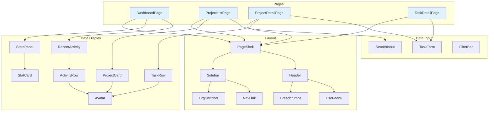

# Component Graph

> Structural edges sourced from graphify AST analysis. Designer metadata (entity bindings, states, health) added by the onboarding skill.
> Re-run `graphify analyze` after major refactors, then run the sync skill to refresh this document.

## Component dependency diagram

<!-- Visual map of component relationships. Renders natively in Obsidian and GitHub. -->
<!-- Pages are highlighted with fill color. Components are grouped by role via subgraphs. -->



## Page-level composition

<!-- Each page as a tree showing real component nesting, data sources, and navigation targets. -->

### DashboardPage (/dashboard)

```
DashboardPage
├── PageShell (layout)
│   ├── Sidebar
│   │   ├── OrgSwitcher (Organization.name, Organization.logo)
│   │   ├── NavLink × N
│   │   └── ProjectList (mini)
│   │       └── ProjectCard × 5 (Project.name, Project.status)
│   └── Header
│       ├── Breadcrumbs
│       └── UserMenu (User.name, User.avatar)
├── StatsPanel
│   ├── StatCard × 4 (projects.count, tasks.count, members.count, overdue.count)
│   └── data: GET /api/stats
└── RecentActivity
    ├── ActivityRow × 10 (Task.title, User.name, action, timestamp)
    │   ├── Avatar (User.avatar)
    │   └── → links to: /tasks/[id]
    └── data: GET /api/activity?limit=10
```

<!-- Add more pages following the same structure -->

## Components by role

### Layout
| Component | Used on | Notes |
|-----------|---------|-------|
| <!-- PageShell --> | <!-- All authenticated pages --> | <!-- Sidebar + header + content area --> |
| <!-- Sidebar --> | <!-- All authenticated pages --> | <!-- Collapsible on mobile --> |
| <!-- Header --> | <!-- All authenticated pages --> | <!-- Breadcrumbs + user menu --> |

### Navigation
| Component | Used on | Notes |
|-----------|---------|-------|
| <!-- Breadcrumbs --> | <!-- All pages except dashboard --> | <!-- Auto-generated from route --> |
| <!-- NavLink --> | <!-- Sidebar --> | <!-- Active state highlights current page --> |
| <!-- Tabs --> | <!-- Project detail, Settings --> | <!-- Underline variant --> |

### Data display
| Component | Used on | Entities | States | Notes |
|-----------|---------|----------|--------|-------|
| <!-- ProjectCard --> | <!-- Dashboard, Project list --> | <!-- Project --> | <!-- populated --> | <!-- Missing loading skeleton --> |
| <!-- TaskRow --> | <!-- Project detail --> | <!-- Task, User --> | <!-- populated, empty --> | <!-- No error state --> |
| <!-- ActivityRow --> | <!-- Dashboard --> | <!-- Task, User --> | <!-- populated --> | <!-- Hardcoded gray text color --> |

### Data input
| Component | Used on | Entities | Notes |
|-----------|---------|----------|-------|
| <!-- TaskForm --> | <!-- New task modal, Task detail --> | <!-- Task, User, Project --> | <!-- react-hook-form + zod --> |
| <!-- SearchInput --> | <!-- Project list, Member list --> | <!-- — --> | <!-- Debounced, 300ms --> |
| <!-- FilterBar --> | <!-- Project list --> | <!-- — --> | <!-- Status + date filters --> |

### Feedback
| Component | Used on | Notes |
|-----------|---------|-------|
| <!-- Toast --> | <!-- Global --> | <!-- Success/error after mutations --> |
| <!-- EmptyState --> | <!-- Project list, Task list --> | <!-- Generic, could be more specific --> |
| <!-- ErrorBoundary --> | <!-- Layout level --> | <!-- Catches render errors, no retry --> |

### Atoms
| Component | Used on | Variants | Notes |
|-----------|---------|----------|-------|
| <!-- Button --> | <!-- Everywhere --> | <!-- primary, secondary, ghost, destructive --> | <!-- Consistent --> |
| <!-- Avatar --> | <!-- Cards, header, activity --> | <!-- sm, md, lg --> | <!-- Falls back to initials --> |
| <!-- Badge --> | <!-- Cards, tables --> | <!-- status colors --> | <!-- Hardcoded colors --> |

## Duplicate components

<!-- Components that do the same thing but exist in multiple versions. -->

| Function | Components | Canonical | Action needed |
|----------|-----------|-----------|---------------|
| <!-- Card layout --> | <!-- HuntCard, CaseCard, ProjectCard --> | <!-- ProjectCard v2 --> | <!-- Migrate HuntCard and CaseCard --> |
| <!-- Data table --> | <!-- DataTable, NewTable --> | <!-- NewTable --> | <!-- Remove DataTable, 3 pages still use it --> |

## Component health

<!-- Summary of design quality per component group. -->

| Group | Count | All 5 states | Responsive | Accessible | Token-only | Notes |
|-------|-------|-------------|------------|------------|------------|-------|
| <!-- Layout --> | <!-- 3 --> | <!-- N/A --> | <!-- Yes --> | <!-- Yes --> | <!-- Yes --> | <!-- Good --> |
| <!-- Data display --> | <!-- 8 --> | <!-- 2/8 --> | <!-- 5/8 --> | <!-- 4/8 --> | <!-- 3/8 --> | <!-- Main concern area --> |
| <!-- Data input --> | <!-- 4 --> | <!-- 3/4 --> | <!-- 4/4 --> | <!-- 3/4 --> | <!-- 4/4 --> | <!-- Mostly good --> |
| <!-- Feedback --> | <!-- 3 --> | <!-- N/A --> | <!-- 2/3 --> | <!-- 1/3 --> | <!-- 2/3 --> | <!-- Toast not accessible --> |
| <!-- Atoms --> | <!-- 6 --> | <!-- N/A --> | <!-- 6/6 --> | <!-- 5/6 --> | <!-- 4/6 --> | <!-- Badge has hardcoded colors --> |
