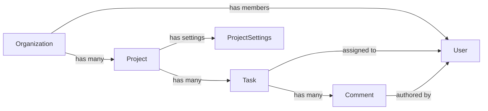

# Entity Map

> Generated by the onboarding skill. Update when new entities are added or relationships change.

## Relationship graph

<!-- ASCII or Mermaid diagram showing how entities connect. -->

## Entities

<!-- One section per entity. Focus on what matters to a designer, not database internals. -->

### Organization

**What it is**: A company or team account. Everything belongs to an organization.

**Designer-relevant fields**:
| Field | Type | Shows up as |
|-------|------|------------|
| <!-- name --> | <!-- string --> | <!-- Header, settings, billing --> |
| <!-- logo --> | <!-- image --> | <!-- Header, sidebar, emails --> |
| <!-- plan --> | <!-- free/pro/enterprise --> | <!-- Billing page, feature gates --> |

**Lifecycle**: created → active → (suspended if unpaid) → deleted

**Where it appears in UI**:
- <!-- Header: org name + logo, always visible -->
- <!-- Settings > Organization: edit name, logo, billing -->
- <!-- Org switcher: if user belongs to multiple orgs -->

**Actions**: create, edit settings, invite members, change plan, delete

---

### Project

<!-- Copy this block for each entity -->

**What it is**: <!-- A container for tasks. Belongs to an organization. -->

**Designer-relevant fields**:
| Field | Type | Shows up as |
|-------|------|------------|
| <!-- name --> | <!-- string --> | <!-- Card title, breadcrumbs, sidebar --> |
| <!-- status --> | <!-- active/archived --> | <!-- Badge on card, filter option --> |
| <!-- memberCount --> | <!-- number --> | <!-- Avatar stack on card --> |

**Lifecycle**: <!-- created → active → archived → deleted -->

**Where it appears in UI**:
- <!-- Dashboard: ProjectCard in sidebar list -->
- <!-- /projects: full list with search and filters -->
- <!-- /projects/[id]: detail page with task list -->
- <!-- Task form: project selector dropdown -->

**Actions**: <!-- create, edit, archive, delete, add/remove members -->

**Relationships**:
- <!-- belongs to: Organization -->
- <!-- has many: Task, User (members) -->

---

<!-- Add more entities following the same structure -->

## Cross-entity interactions

<!-- Flows where multiple entities interact. Important for understanding the product. -->

| Action | Entities involved | Screens |
|--------|------------------|---------|
| <!-- Assign task --> | <!-- Task + User --> | <!-- Task detail, task form --> |
| <!-- Move task to another project --> | <!-- Task + Project × 2 --> | <!-- Task detail, modal picker --> |
| <!-- Invite member --> | <!-- Organization + User --> | <!-- Settings > Members --> |
