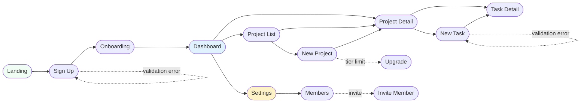
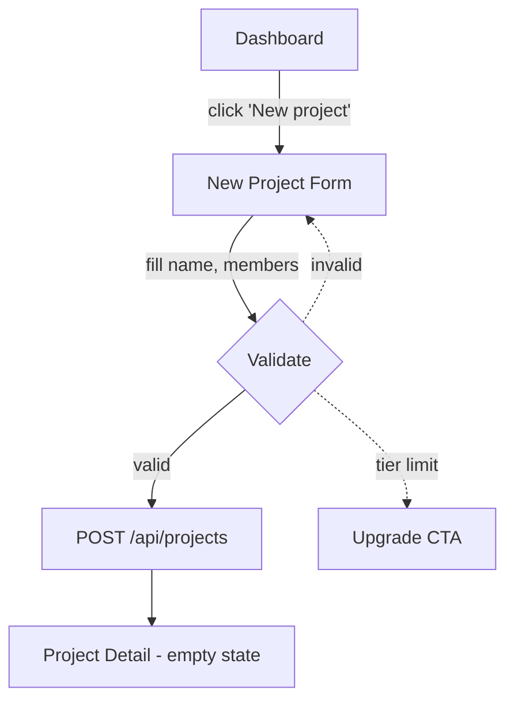
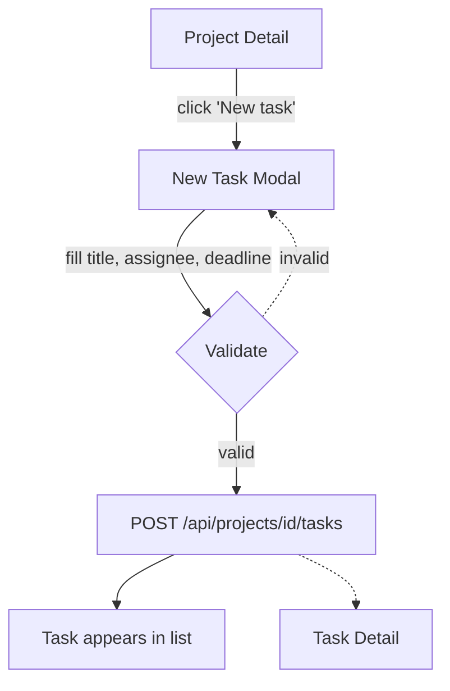

# User Flows

> Generated by the onboarding skill. Describes the actual paths users take through the product.
> Each flow connects screens, entities, and components.
> Use these as input for E2E test generation.

## Flow map

<!-- Visual overview of how users navigate between screens. Renders natively in Obsidian and GitHub. -->
<!-- Solid arrows = primary paths. Dashed arrows = error/edge case paths. -->

## Flow overview

<!-- Map of all key flows and which entity they operate on. -->

| Flow | Actor | Entity | Screens involved | Has E2E test? |
|------|-------|--------|-----------------|---------------|
| <!-- Create project --> | <!-- Manager --> | <!-- Project --> | <!-- Dashboard → New Project → Project Detail --> | <!-- No --> |
| <!-- Create task --> | <!-- Member --> | <!-- Task --> | <!-- Project Detail → New Task modal → Task Detail --> | <!-- No --> |
| <!-- Assign task --> | <!-- Manager --> | <!-- Task + User --> | <!-- Task Detail --> | <!-- No --> |
| <!-- Sign up --> | <!-- New user --> | <!-- User + Org --> | <!-- Landing → Sign up → Onboarding → Dashboard --> | <!-- Yes --> |

## Flows

### Create a new project

**Actor**: Project manager
**Goal**: Set up a new project for the team

**Steps**:
1. **Dashboard** (`/dashboard`)
   → User clicks "New project" button in sidebar or empty state CTA
2. **New project form** (`/projects/new` or modal)
   → Fills in: name, description (optional), members (optional)
   → Members picker shows organization members (User[])
3. **Submit** → POST /api/projects
4. **Project detail** (`/projects/[id]`)
   → Sees the empty project with "Add your first task" CTA

**Error path**:
- Validation: name required, max 100 chars → inline errors
- Server error → toast "Failed to create project, try again"

**Edge cases**:
- <!-- Free tier limit reached → show upgrade CTA instead of form -->
- <!-- User has no org → redirect to org creation first -->

**Screens**: Dashboard → New Project → Project Detail
**Entities**: Project, Organization, User
**Components**: ProjectForm, MemberPicker, Avatar, EmptyState

---

### Create a new task

**Actor**: Team member
**Goal**: Add a task to a project

**Steps**:
1. **Project detail** (`/projects/[id]`)
   → Clicks "New task" button above the task list
2. **New task form** (modal overlay)
   → Fills in: title, description, assignee (User), deadline (date), priority
   → Assignee picker shows project members
3. **Submit** → POST /api/projects/[id]/tasks
4. **Project detail** (task appears in list)
   → Or redirect to **Task detail** (`/tasks/[id]`)

**Error path**:
- Validation: title required → inline error
- Network error → toast with retry

**Edge cases**:
- <!-- No project members → assignee picker shows "Invite members" link -->
- <!-- Task limit reached on free tier → upgrade CTA -->

**Screens**: Project Detail → New Task modal → (Task Detail)
**Entities**: Task, Project, User
**Components**: TaskForm, UserPicker, DatePicker, Modal

---

<!-- Add more flows following the same structure -->

## Missing flows

<!-- Flows that users probably need but the product doesn't support yet. -->

| Expected flow | Why it's needed | Current workaround |
|--------------|----------------|-------------------|
| <!-- Bulk edit tasks --> | <!-- Manager wants to reassign 10 tasks at once --> | <!-- Edit one by one --> |
| <!-- Export project --> | <!-- Client wants a PDF report --> | <!-- None --> |
| <!-- Duplicate project --> | <!-- Template projects for similar clients --> | <!-- Create from scratch each time --> |

## Flow gaps

<!-- Steps within existing flows that are missing or broken. -->

| Flow | Gap | Impact |
|------|-----|--------|
| <!-- Create task --> | <!-- No confirmation that task was created (no toast, no highlight) --> | <!-- User unsure if action succeeded --> |
| <!-- Delete project --> | <!-- No confirmation dialog --> | <!-- Accidental deletion risk --> |
| <!-- Sign up --> | <!-- No email verification step --> | <!-- Security concern --> |
