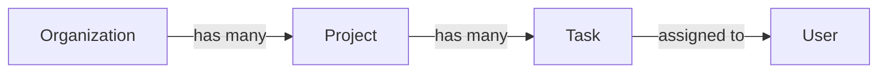
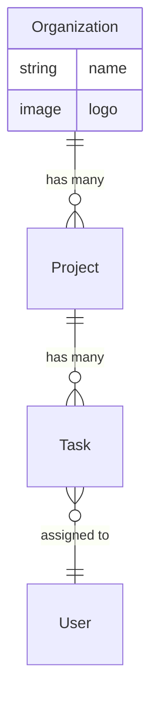
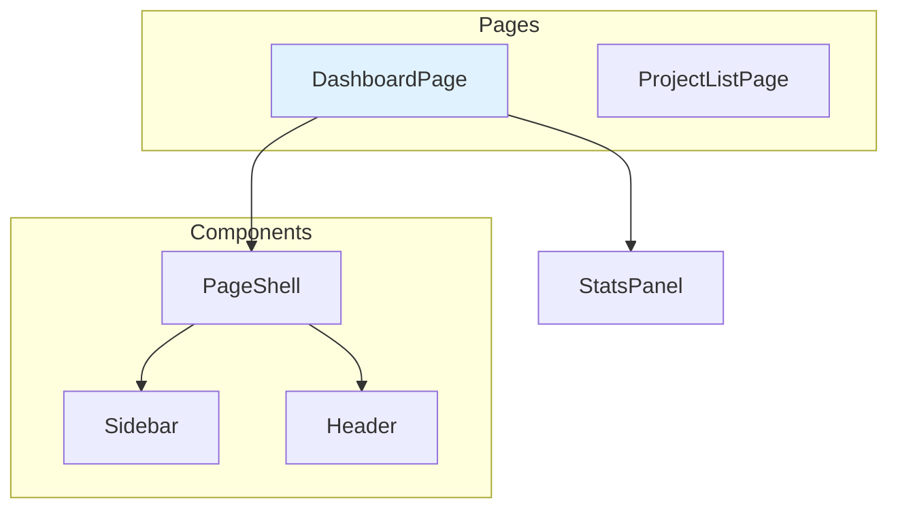
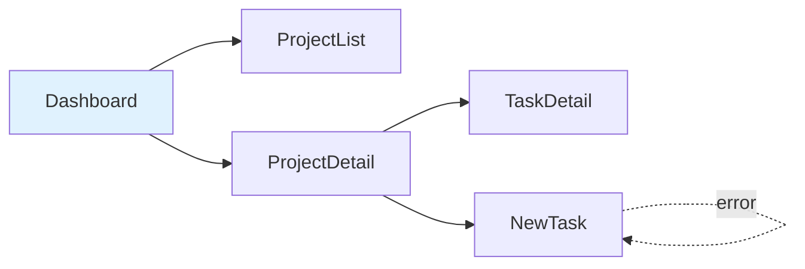

# Onboarding Skill

Analyze an existing codebase and produce a designer-friendly knowledge base:
what the product is, how it works, what it looks like, and how everything connects.

## When to use

- Designer joins a client project for the first time
- No documented product overview, entity map, or visual inventory exists
- The team needs a shared understanding of the product before making changes

## What this skill produces

Six interconnected documents, each answering a different designer question:

1. **product-overview.md** — "What is this product and who is it for?"
2. **entity-map.md** — "What are the key objects and how do they relate?"
3. **screen-inventory.md** — "What does the product look like right now?"
4. **component-graph.md** — "What building blocks exist and where are they used?"
5. **user-flows.md** — "What do people actually do in this product?"
6. **visual-language.md** — "What is the current design system, honestly?"

Plus supporting files:
- **_index.md** — master index of all vault documents (AI reads this first)
- **token-audit.md** — appendix to visual-language, raw data
- **architecture.md** — tech stack for when the designer needs it
- **baseline/quality-snapshot.md** — current quality state (lint, tests, typecheck)

---

## Step 0: Ask the designer what code can't tell you

Before analyzing any code, ask the designer these questions.
Accept whatever they can answer — skip the rest.

**Team and process:**
- Who else works on this project? (devs, PM, other designers)
- Who approves design changes?
- What's the process from design to release? (PRs? staging? design review?)

**Access to the product:**
- Is there a staging or production URL where I can see the live product?
- Is there a deployed Storybook?
- Do you have credentials for a test account?

**Existing design artifacts:**
- Is there a Figma file for this project? (paste the URL)
- Are there previous design decisions documented anywhere?
- Any screens or flows you already know are problematic?

**Scope:**
- What are you here to do? (redesign? new feature? design system cleanup? ongoing support?)

Store the answers in `product-overview.md` under a "Designer context" section.
These answers fill gaps that code analysis cannot.

If the designer says "just analyze the code, I'll answer questions later" — proceed
with code-only analysis. Come back to these questions when they're ready.

---

## Step 1: Understand the product

### From the codebase (primary source)
- README.md, ABOUT, marketing pages, meta tags, `<title>` elements
- Copy/text in the UI — headings, onboarding screens, empty states, error messages
- User roles and permissions (who can do what)
- API routes and their naming (reveals domain language)
- Database models / type definitions (reveals business entities)

### From public sources (secondary, marked as external)
Search for the product/company in public sources:
- Company website, "About" page, pricing page
- Product Hunt, G2, Capterra — positioning and user reviews
- Blog posts, press releases, case studies
- Social media bios and descriptions
- Competitor mentions (reveals market positioning)

**Mark all external information clearly:**
> [External source: company website] Acme positions itself as "project management for remote teams"

External sources help the designer understand:
- How the company describes itself (vs what the code shows)
- Who the target audience is (from marketing, not just from roles in code)
- What features are highlighted (vs what actually exists)
- Pricing tiers and their constraints (which features are gated)
- Competitor landscape (what visual patterns the market expects)

**If the product is internal or NDA-protected, skip this step.**

**Output → `product-overview.md`:**
- One paragraph: what the product does, in plain language
- Who uses it (user types/roles, not technical auth roles)
- What value each user type gets
- Key terminology — the domain language the product uses
  (e.g., "Hunt" means a job listing, "Case" means a candidate application)
- Business constraints if visible (multi-tenant? subscription tiers? public/private?)
- External context section (clearly separated and sourced)

---

## Step 2: Map the entities

Trace all business entities from:
- Database schema / ORM models (Prisma, Drizzle, TypeORM, etc.)
- TypeScript types and interfaces for domain objects
- API response shapes
- Form fields (what the user creates/edits)
- URL structure (what gets an ID in the URL is an entity)

**Output → `entity-map.md`:**

For each entity:
- Name and what it means in plain language
- Fields that matter to the designer (not internal IDs or timestamps)
- Lifecycle: what states it goes through (draft → published → archived)
- Where it appears in the UI (list, detail, card, form, mention)
- What actions users perform on it (create, edit, delete, assign, share)

Relationships as Mermaid diagrams (rendered natively in Obsidian and GitHub):

1. **Relationship overview** — `graph LR` for quick orientation:


2. **ER diagram** — `erDiagram` with cardinality and key fields:


Include only designer-relevant fields in the ER diagram (not internal IDs or timestamps).
Use `||--o{` for one-to-many, `}o--||` for many-to-one, `||--||` for one-to-one.

Cross-reference: link each entity to screens and components where it appears.

---

## Step 3: Screenshot every screen

Try these approaches in order. Use the first one that works:

### Option A: Staging / production URL (from Step 0)
If the designer provided a staging or production URL:
1. Use Playwright to navigate to the URL
2. Capture key pages at desktop (1280px) and mobile (375px)
3. This is often the easiest path — no local setup needed

### Option B: Local development server
If the app can be started locally (`npm run dev` or equivalent):
1. Start the dev server
2. Discover all routes from the routing configuration
3. Navigate to each route in a logged-in state (use test credentials from Step 0)
4. Capture at desktop (1280px) and mobile (375px) widths
5. Capture key states: populated, empty, loading (if possible)

### Option C: Storybook
If Storybook is available (check `.storybook/` directory or `storybook` in package.json):
1. Start Storybook (`npm run storybook`)
2. Capture every story — this gives you each component in isolation with all variants
3. This is the best source for the component graph visual catalog
4. Storybook screenshots go into `screenshots/components/`

### Option D: Static analysis only
If nothing above works (no staging, app won't start, no Storybook):
1. Analyze JSX/TSX to understand layouts from code
2. Read CSS/Tailwind classes to infer visual appearance
3. Note what you could not capture and what's needed to unblock it
4. Flag this clearly: "Visual inventory is incomplete — need staging URL or local dev setup"

**Always try Storybook in addition to page screenshots** — pages show integration,
Storybook shows individual component anatomy. Both are valuable.

**Output → `screen-inventory.md`:**

For each screen:
```markdown
## /projects — Project List


**Purpose**: Browse and search all projects in the organization
**Entities on screen**: Project, Organization (in header)
**Components used**: ProjectCard, SearchInput, Pagination, EmptyState
**Entry points**: Sidebar nav, dashboard "View all" link
**Exit points**: Click project → /projects/[id], "New project" → /projects/new
**States captured**: populated, empty
**Issues noticed**: No loading skeleton, mobile layout clips long project names
```

---

## Step 4: Build the component graph

Scan the codebase for all UI components. For each one, trace:
- Where it is used (which pages, which parent components)
- What data it receives (props → which entity fields)
- What it renders (child components)
- What interactions it supports (click → navigate, submit → API call)

**Output → `component-graph.md`:**

Start with a Mermaid dependency diagram showing how pages connect to components:

Use `subgraph` to group by role (Pages, Layout, Data Display, etc.).
Color page nodes with `fill:#e0f2fe` for visual distinction.

Then provide detailed composition as a tree showing real nesting, not a flat list:

```markdown
## DashboardPage (/dashboard)

DashboardPage
├── StatsPanel
│   ├── StatCard × 4 (projects.count, tasks.count, members.count, overdue.count)
│   └── data source: GET /api/stats
├── RecentActivity
│   ├── ActivityRow × N (Task.title, User.name, action, timestamp)
│   │   └── Avatar (User.avatar)
│   └── data source: GET /api/activity?limit=10
│   └── links to: TaskDetail, UserProfile
└── ProjectList (sidebar)
    ├── ProjectCard × N (Project.name, Project.status, Project.memberCount)
    │   └── Avatar (User.avatar) × 3 (first 3 members)
    └── data source: GET /api/projects?limit=5
    └── links to: ProjectDetail, ProjectList
```

For each component, also note:
- **Status**: active / legacy / deprecated / duplicate
- **Variants**: if it has size, color, or mode variants
- **States implemented**: which of the 5 states (loading, error, empty, populated, partial) exist
- **Design issues**: hardcoded values, missing responsive, missing a11y

Group components by role:
- **Layout** — shells, sidebars, headers, footers
- **Navigation** — menus, breadcrumbs, tabs, links
- **Data display** — tables, cards, lists, detail views
- **Data input** — forms, filters, search, file upload
- **Feedback** — toasts, modals, alerts, empty states, error boundaries
- **Atoms** — buttons, badges, avatars, icons, tooltips

---

## Step 5: Trace user flows

Combine screen inventory + entity map + component graph to reconstruct
the actual user journeys:

1. Read navigation structure (sidebar, header, routing)
2. Trace link targets and form submissions
3. Identify the main CRUD flows for each entity
4. Identify cross-entity flows (create task from project page)

**Output → `user-flows.md`:**

Start with a flow map — a Mermaid `flowchart LR` showing all screens and navigation paths:

Use solid arrows for primary paths, dashed arrows for error/edge case paths.
Color key screens for visual orientation.

Then document each flow with its own Mermaid `flowchart TD` showing steps:

```markdown
## Create a new task

**Actor**: Project member
**Goal**: Add a task to a project

1. **Project page** (/projects/[id])
   → sees task list, clicks "New task" button
2. **New task form** (modal or /projects/[id]/tasks/new)
   → fills: title, description, assignee (User), deadline
   → assignee picker shows project members (User[])
3. **Submit**
   → POST /api/projects/[id]/tasks
   → redirect to task detail
4. **Task detail** (/tasks/[id])
   → sees the created task, can edit inline

**Error path**: validation error → inline field errors, form stays open
**Empty state path**: no project members → assignee picker shows "Invite members" CTA
```

Flag missing flows:
- Can the user delete a task? (no delete button found)
- What happens on permission error? (no 403 handling)

---

## Step 6: Document the visual language

This is what the product actually looks like, not what it should look like.

Take real examples from the codebase and screenshots:

**Output → `visual-language.md`:**

### Colors in practice
Extract all actually-used colors. Group them:
- Colors that come from tokens (good) — show the token name and swatch
- Colors that are hardcoded but consistent (fixable) — "this blue is used 23 times, should be a token"
- Colors that are inconsistent (problem) — "3 different grays for borders"

Show real examples: "Header uses `--color-primary`, but the CTA button on the pricing page uses hardcoded `#2563EB` which is close but not the same."

### Typography in practice
- What fonts are loaded (from <link>, @import, or config)
- What sizes actually appear and where
- Inconsistencies: "h2 on dashboard is 24px, h2 on settings is 20px"

### Spacing patterns
- Common gaps between elements
- Whether spacing is consistent or chaotic

### Component styling patterns
Show real screenshots of:
- Buttons — all variants as they appear in the product
- Cards — all card-like components side by side
- Forms — how inputs, labels, and errors look
- Tables — data display patterns
- Empty states — what exists, what's just "No data"

### Consistency report
- What's consistent and good (keep this)
- What's inconsistent (fix these first)
- What's missing (no empty states, no error boundaries, etc.)

Reference the detailed numbers in `token-audit.md`.

---

## Step 7: Generate supporting files

### token-audit.md
Raw data: all tokens, all hardcoded values, file locations.
Referenced from visual-language.md for the details.

If the designer has a Figma file with variables, suggest running `vdk-sync-tokens`
after onboarding to reconcile Figma tokens with what's in the code.

### architecture.md
Tech stack, project structure, build tools, testing setup.
The designer doesn't need this first, but it's there when they ask "why does X work that way?"

### Quality baseline
Run all available quality checks and record the starting point:

```bash
# Run whatever is available
npm run lint 2>&1 | tail -20         # Lint errors
npx tsc --noEmit 2>&1 | tail -20     # Type errors
npm run test -- --run 2>&1 | tail -20 # Test results
```

Record in `baseline/quality-snapshot.md`:
- Lint: X errors, Y warnings
- TypeScript: X errors
- Tests: X pass, Y fail, Z skip
- Playwright: X pass, Y fail (or "not configured")
- Storybook: X stories (or "not installed")

This is the starting line. Every change must not make it worse.

If quality infrastructure is missing (no lint, no tests), note it clearly:
"This project has no automated quality checks. Any change should be verified
manually. Consider asking the team to set up ESLint, TypeScript, and Playwright."

---

## Step 7b: Populate DESIGN.md from code

After generating `visual-language.md` and `token-audit.md`, use them to pre-fill
the project's `DESIGN.md`. This bridges the gap between "what the code does" and
"what the designer intends."

### Data sources (in priority order)

1. **Token system** — CSS variables, Tailwind config, theme files (highest confidence)
2. **visual-language.md** — the audit you just generated
3. **token-audit.md** — raw data for anything the audit summarized

### What to auto-fill

Fill a value in DESIGN.md when it meets **both** criteria:
- It comes from the project's token system (CSS variable, Tailwind config, theme object)
- It is used **consistently** across the codebase (no conflicting values for the same purpose)

Mark each auto-filled value with `[auto-filled]`:
```markdown
| `--color-primary` | #3B82F6 [auto-filled] | Primary actions, links |
```

### What to flag for designer decision

When the code uses **multiple values** for the same purpose (identified in
visual-language.md under "Inconsistent"), list all variants and ask the designer to pick:

```markdown
| `--color-border` | [inconsistent] #E5E7EB / #D1D5DB / #E2E8F0 | Borders, dividers — pick one |
```

### What to leave blank

When no value exists in the code for a DESIGN.md field, mark it so the designer
knows it's not an oversight:

```markdown
| `--shadow-lg` | [missing] | Modals, popovers |
```

### Sections to auto-fill

| DESIGN.md section | Source |
|-------------------|--------|
| Brand | Product name from `<title>`, README, or `package.json` `name`. Voice and logo: leave blank. |
| Colors — Primary palette | Tokenized colors from token-audit.md |
| Colors — Semantic colors | Semantic tokens (success, warning, error, info) from token system |
| Colors — Neutrals | Background, surface, border, text tokens |
| Typography | Font families from `@font-face` / Google Fonts links, sizes from token system |
| Spacing | Spacing scale from Tailwind config or CSS variables |
| Border radius | Radius tokens |
| Shadows | Shadow tokens |
| Breakpoints | From Tailwind config or media queries in code |
| Animation | Duration/easing from CSS variables or transition patterns in code |

### Sections to NOT auto-fill

These require designer intent, not code facts:
- **Component guidelines** — design decisions about how components should behave
- **Visual references** — mood, inspiration, aesthetic direction
- **Figma** — links the designer provides
- **Notes** — designer's additional rules

### After populating

Tell the designer what happened:
```
I pre-filled DESIGN.md from your codebase:
- 18 values auto-filled (consistent in code) — review and approve
- 4 values flagged as inconsistent — pick which one you want
- 6 values missing — fill in from Figma or leave blank for now

Open DESIGN.md to review. Search for [auto-filled], [inconsistent], and [missing].
```

---

## Step 8: Storybook inventory (if available)

If Storybook is installed:
1. Start Storybook
2. List all stories by component
3. Screenshot each story
4. Note which components have stories and which don't
5. Note which states are covered in stories and which are missing

This feeds directly into `component-graph.md`:
- Component has story → mark as "documented"
- Story covers all variants → mark as "fully documented"
- No story → mark as "needs story"

If Storybook is not installed, skip this step and note in component-graph.md
that visual documentation is missing.

---

## Step 9: Generate the master index

Create `_index.md` — the single entry point for AI and designers to navigate the vault.

**What to include:**
1. **Primary documents table** — each document with a one-line summary and last updated date
2. **Supporting reference table** — token-audit, architecture, baseline
3. **Detail layer table** — any detail documents created (entities, decisions, issues, flows, patterns)
4. **Quick lookup table** — each entity cross-referenced with its screens, components, and flows
5. **Designer annotations count** — total across all files, list which files have them

**Summaries must be concrete, not generic:**
- Bad: "Entity relationships"
- Good: "5 entities (Organization, Project, Task, User, Comment), Organization → Project → Task hierarchy"

**Why this matters:**
AI reads `_index.md` first before any pre-task check. A good index means the AI reads 1 file
instead of scanning 6+ documents to find relevant context. This saves ~70% of tokens on lookups.

**Keep it current:**
The sync skill updates `_index.md` on every sync. After onboarding, the index reflects
the initial state. Future syncs update summaries and dates.

---

## Step 10: Present to the designer

Do NOT dump files and say "done." Present a guided walkthrough:

### Summary (spoken to the designer)

1. **The product in one sentence**: "This is a project management tool for small teams."
2. **Key screens** (3-5 screenshots): "Here are the main pages."
3. **Main entities**: "The product revolves around Organizations, Projects, Tasks, and Users."
4. **How they connect**: Show the entity graph.
5. **Top user flows**: "The most common things users do are: create tasks, assign them, track progress."
6. **Design system health**:
   - What's working: "Buttons are consistent, card patterns are reusable"
   - What's broken: "3 different blues, no loading states, mobile layout breaks on 2 pages"
7. **Code quality baseline**:
   - "Lint: 0 errors. Tests: 24 pass, 2 fail. TypeScript: clean."
   - Or: "No lint, no tests, no TypeScript. We're starting from zero on quality."
   - "Storybook: 15 stories covering 8 of 24 components" or "No Storybook installed"
8. **DESIGN.md status**: "I pre-filled DESIGN.md with N values from your code.
   Review the `[auto-filled]` values and resolve the `[inconsistent]` ones."
9. **Tooling gaps**: check what skills and MCP servers are installed vs recommended.
   Suggest missing ones (see Step 11).
10. **Recommended first actions**:
   - Quick wins (fix hardcoded colors, add missing empty states)
   - Important but larger (consolidate duplicate components, add responsive layouts)
   - Quality gaps (add Storybook stories, add missing tests, fix lint warnings)
   - Needs discussion (entity naming confusion, missing user flows)

### File locations
Tell the designer where each file is and what question it answers.

---

## Step 11: Check installed tools and suggest missing ones

Review what skills, plugins, and MCP servers are available and recommend
tools the designer might be missing. Reference `recommended-tools.md`.

### Check for installed skills/plugins

Look at `.claude/` directory and settings for installed plugins and skills.

### Check for MCP servers

List available MCP servers (use `claude mcp list` or check config).

### Recommend based on project stack

| If project uses... | Recommend |
|--------------------|-----------|
| React / Next.js | react-best-practices, composition-patterns skills |
| shadcn/ui | shadcn/ui skill |
| Storybook | Storybook MCP server |
| Playwright | Playwright MCP server |
| Figma (designer has access) | Verify Figma MCP is connected |
| No test runner | Suggest Vitest + tdd-guard |
| No linter | Suggest Biome |

### Report to designer

```
Installed:
  ✓ superpowers (TDD, planning, code review)
  ✓ web-design-guidelines (UI quality rules)
  ✓ Playwright MCP (browser automation)
  ✓ Figma MCP (design context)

Missing (recommended for this project):
  ✗ Storybook MCP — project has Storybook but MCP is not connected
    Install: npx storybook@latest add @storybook/addon-mcp
  ✗ react-best-practices — project uses Next.js
    Install: npx skills add vercel-labs/agent-skills --skill react-best-practices -a claude-code
  ✗ A11y MCP — no accessibility testing tool found
    Install: claude mcp add a11y-accessibility -- npx -y a11y-mcp-server
```

Ask the designer: "Want me to install the missing tools?"

If a recommended tool fails to install or the designer declines,
note it and continue — no tool is required for onboarding to work.

---

## Source of truth

Remember: the code is always the primary source of truth.
Everything generated by this skill describes the code at a point in time.
When the code changes, these documents become stale and must be updated
(via the sync skill or manually).

---

## Output location

Place all files in the knowledge base project directory if configured,
or in `design-knowledge/` at the project root.

Place screenshots in a `screenshots/` subdirectory next to the documents.

## Example invocation

```
I'm a designer joining this project. Run onboarding — I need to understand
what this product is, how it works, and what it looks like before I touch anything.
```
